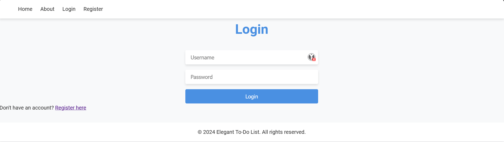
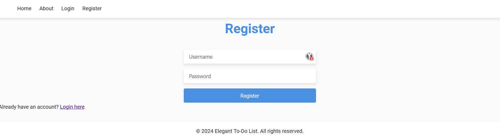
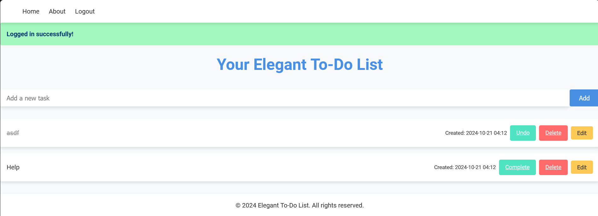
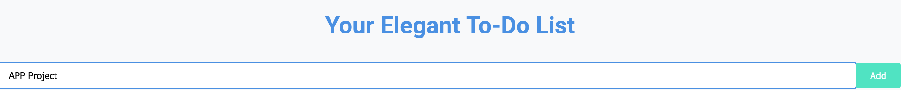
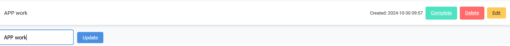
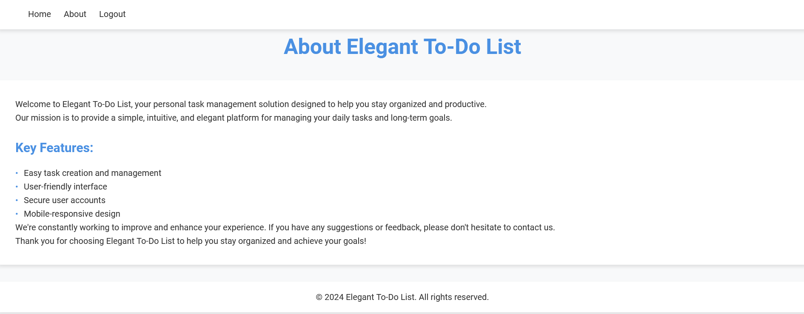

# Flask Task-Dashboard Application

A secure and feature-rich Task-Dashboard web application built with Flask, SQLAlchemy, and SQLite. This application allows users to manage their daily tasks with user authentication and persistent storage.


## 🚀 Features

- ✨ User Authentication (Register/Login/Logout)
- 📝 Create, Read, Update, and Delete tasks
- ✅ Mark tasks as complete/incomplete
- 🔒 Secure password hashing
- 📱 Responsive design
- ⚡ Real-time updates with Flask flash messages
- 🔍 View tasks in chronological order

## 🛠️ Prerequisites

Before running this application, make sure you have the following installed:

- Python 3.7+
- pip (Python package manager)

## 📦 Installation

1. Clone the repository:
```bash
git clone https://github.com/yourusername/flask-todo-app.git
cd flask-todo-app
```

2. Create a virtual environment:
```bash
python -m venv venv
source venv/bin/activate  # On Windows: venv\Scripts\activate
```

3. Install required packages:
```bash
pip install flask flask-sqlalchemy werkzeug
```

4. Initialize the database:
```bash
python app.py
```

## 🚦 Usage

1. Start the application:
```bash
python app.py
```

2. Open your web browser and navigate to:
```
http://localhost:5000
```

3. Register a new account or login to start managing your tasks!

## 🔑 Environment Variables

Configure the following environment variables in your `.env` file:

```env
SECRET_KEY=your_secret_key_here
SQLALCHEMY_DATABASE_URI=sqlite:///todo.db
```

## 🗄️ Project Structure

```
flask-todo-app/
├── app.py                 # Main application file
├── templates/            # HTML templates
│   ├── home.html        # Main todo list view
│   ├── login.html       # Login page
│   ├── register.html    # Registration page
│   └── about.html       # About page
├── static/              # Static files (CSS, JS)
├── todo.db              # SQLite database
└── requirements.txt     # Python dependencies
```

## 📝 Database Schema

### User Model
```python
class User(db.Model):
    id = db.Column(db.Integer, primary_key=True)
    username = db.Column(db.String(80), unique=True, nullable=False)
    password_hash = db.Column(db.String(120), nullable=False)
    todos = db.relationship('TodoItem', backref='user', lazy=True)
```

### TodoItem Model
```python
class TodoItem(db.Model):
    id = db.Column(db.Integer, primary_key=True)
    content = db.Column(db.String(200), nullable=False)
    created_at = db.Column(db.DateTime, default=datetime.utcnow)
    completed = db.Column(db.Boolean, default=False)
    user_id = db.Column(db.Integer, db.ForeignKey('user.id'), nullable=False)
```

## 🔒 Security Features

- Password hashing using Werkzeug's security functions
- Session-based authentication
- CSRF protection with Flask-WTF (recommended to add)
- Route protection with login_required decorator
- User data isolation

## 🛣️ API Routes

| Route | Method | Description | Authentication Required |
|-------|--------|-------------|------------------------|
| `/` | GET | Home page with todo list | Yes |
| `/add` | POST | Add new todo item | Yes |
| `/delete/<id>` | GET | Delete todo item | Yes |
| `/toggle/<id>` | GET | Toggle todo completion | Yes |
| `/update/<id>` | POST | Update todo content | Yes |
| `/register` | GET/POST | User registration | No |
| `/login` | GET/POST | User login | No |
| `/logout` | GET | User logout | No |
| `/about` | GET | About page | No |

## 🔧 Future Improvements

- [ ] Add task categories
- [ ] Implement due dates
- [ ] Add task priority levels
- [ ] Enable task sharing between users
- [ ] Add email notifications
- [ ] Implement REST API
- [ ] Add task search functionality
- [ ] Support for file attachments

## 🤝 Contributing

1. Fork the repository
2. Create your feature branch (`git checkout -b feature/AmazingFeature`)
3. Commit your changes (`git commit -m 'Add some AmazingFeature'`)
4. Push to the branch (`git push origin feature/AmazingFeature`)
5. Open a Pull Request

## 📄 License

This project is licensed under the MIT License - see the LICENSE file for details.

## 📬 Contact

Aparna Sing- (https://github.com/aparna12-03)  

## 🙏 Acknowledgments

- Flask documentation
- SQLAlchemy documentation
- Python community

# Output

## Login page


## Register page


## Homepage


## Add a new task


## Edit a task


## About us page

